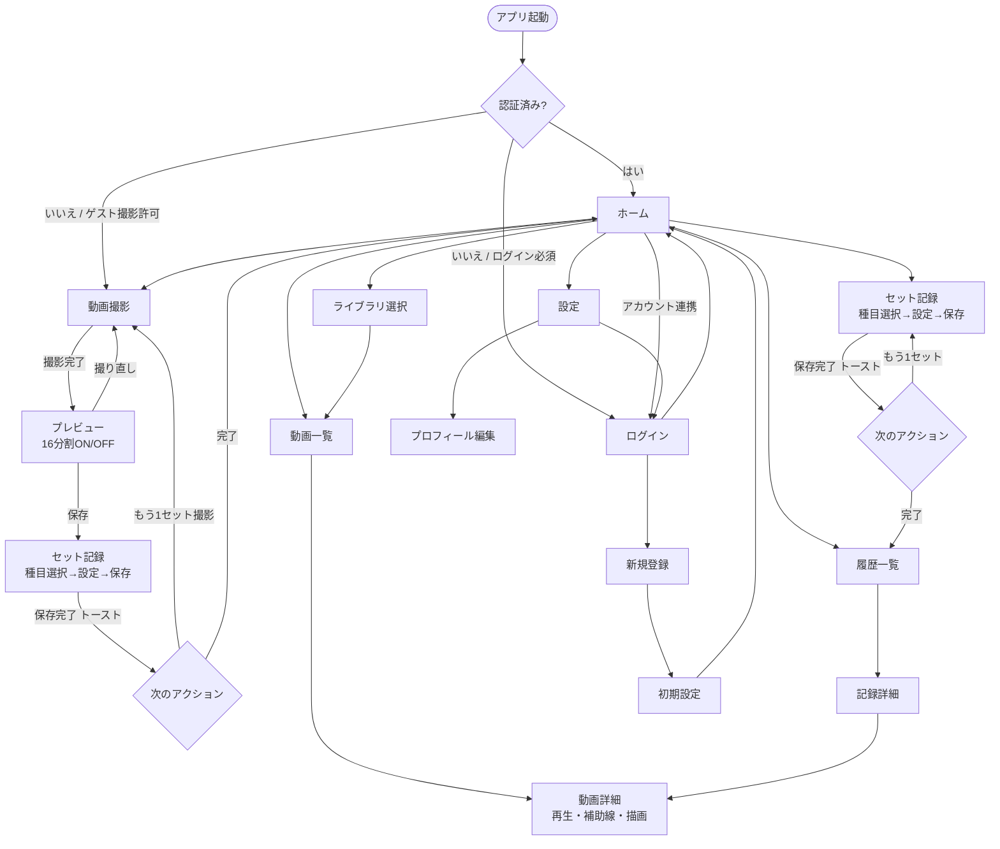

# 画面遷移図

**関連**: [requirements/02-functional.md](../requirements/02-functional.md)、[requirements/08-user-flow-and-steps.md](../requirements/08-user-flow-and-steps.md)  
**設計方針**: [Tonal Add Movement Flow プロトタイプ](../../Downloads/tonal_add_movement_flow_prototype.html) の画面遷移原則に準拠

---

## 設計方針（Tonal フローから抽出）

Tonal のムーブメント追加フロー（0〜10）から導いた画面遷移の原則:

| 原則 | 内容 |
|------|------|
| **入口を1箇所に絞る** | 追加・記録の起点は常に明確に1つ。迷わせない |
| **探索 → 選択 → 設定 → 確定** | 段階ごとに目的を分ける。1画面に複数の目的を混ぜない |
| **選択状態を色以外でも明示** | チェックマーク・太字・位置で選択を表現。色依存しない |
| **設定はカード内で完結** | 画面遷移せず、カード行の中でステッパーやトグルで調整 |
| **補足はモーダルで文脈を保つ** | 説明が必要なときは別画面に飛ばず、モーダルでその場に返す |
| **完了はトーストで軽く返す** | 成功時は黒トースト1行。別画面に飛ばさず編集を続けさせる |
| **元の文脈へ自然に戻す** | 追加後は編集画面に戻り、結果を確認してそのまま次へ |

---

## MVP 画面遷移（Mermaid）

---

## 各画面の役割（Tonal フローに対応）

| 画面 | Tonal 対応 | 役割 | ユーザーがやること |
|------|-----------|------|----------------|
| **ホーム** | 0（入口） | 全体の起点。記録・撮影の入口を明確に見せる | 撮影 or 記録を選ぶ |
| **セット記録** | 1→2→3（探索→選択→設定） | 種目を選び、設定カードで数値を調整し、保存する | 種目選択 → 重量・回数・セットをステッパーで設定 → 保存 |
| **撮影** | — | カメラプレビューと録画。入口を1つに絞る | 録画 or ライブラリから選択 |
| **動画詳細** | — | 再生・補助線・描画でフォームを確認 | 再生・分析・メモ |
| **記録詳細** | 8（追加結果） | 記録の内容を確認する。結果を視覚的に返す | 内容確認、関連動画へ遷移 |
| **設定** | — | プロフィールや環境設定 | 設定変更 → 保存 |

---

## 補足

- **撮影 → セット記録**: 撮影完了後は自動でセット記録画面へ遷移し、動画と紐付ける。
- **成功フィードバック**: 保存完了時は黒トースト（「セットを保存しました」）で短く返す。別画面に遷移しない。
- **戻る遷移**: 各画面はブラウザバック / ← ボタンで戻れる。
- **認証の分岐**: [decision-log.md](../development/06-decision-log.md) の ADR-001 に従う。
