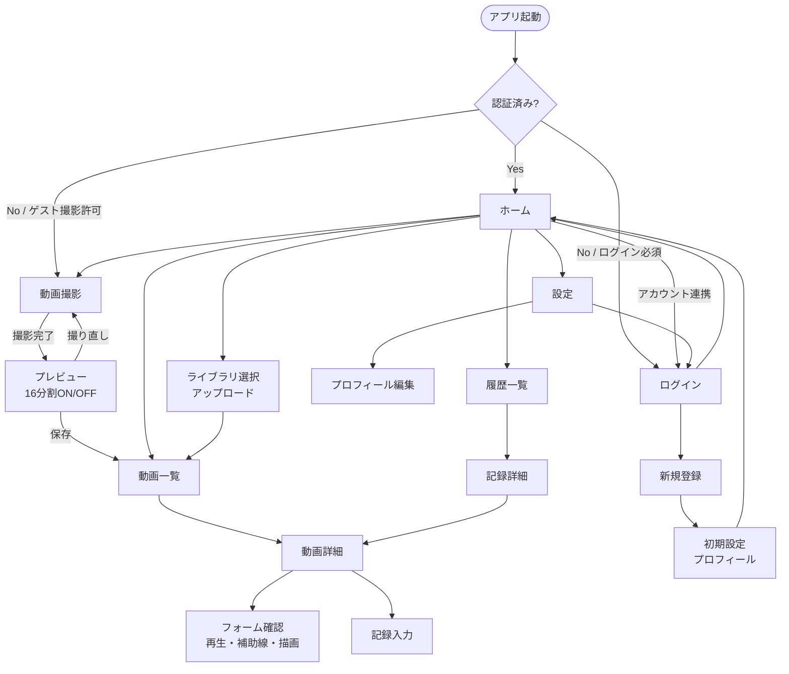

# 画面遷移図

**関連**: [requirements/02-functional.md](../requirements/02-functional.md)、[requirements/08-user-flow-and-steps.md](../requirements/08-user-flow-and-steps.md)

---

## MVP 画面遷移（Mermaid）

---

## 補足

- **CAPTURE → PREVIEW**: 撮影中は常に **16分割グリッドの ON/OFF ボタン**が表示される。初期は ON。
- **AUTH_CHECK の分岐**: [decision-log.md](../development/06-decision-log.md) の ADR-001 に従う。
- Phase2 の **比較画面** は動画詳細から遷移予定（MVPでは未実装）。
- 各画面の戻る遷移（Back）は省略しているが、基本的にブラウザバック／ナビゲーションで戻れる。
