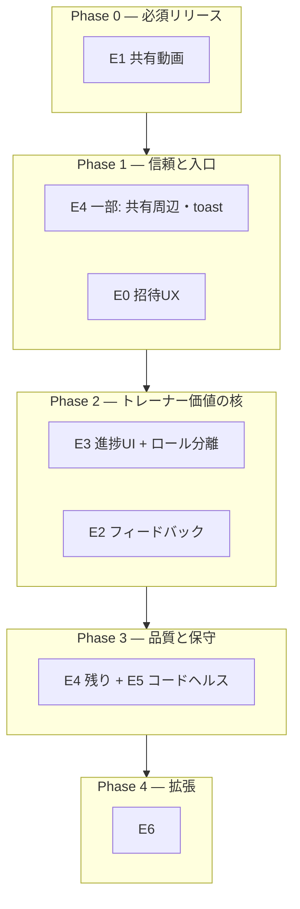

# FormCheck 実装計画書（2026-04 改訂版）

**版**: v2（2026-04-25 ブラッシュアップ）  
**役割**: エンジニア・TL・PM がスプリント計画と Issue 化の共通参照とする。  
**詳細見積もり**: 本書の T シャツは粗目。スプリント開始時にチケット単位で更新する。

---

## ドキュメントマップ（上流〜下流）

| 種別 | パス |
|------|------|
| 辛口評価・技術スコア | [../harsh-evaluation-2026-04-25-v5.md](../harsh-evaluation-2026-04-25-v5.md) |
| 行動要件・マンツー前提 | [2026-04-25-01-pm-behavior-requirements.md](./2026-04-25-01-pm-behavior-requirements.md) |
| 残存課題バックログ（BL ID） | [2026-04-25-02-pm-residual-issues-backlog.md](./2026-04-25-02-pm-residual-issues-backlog.md) |
| UX・情報設計 | [2026-04-25-03-designer-ux-experience-upgrades.md](./2026-04-25-03-designer-ux-experience-upgrades.md) |
| オンボーディングフロー（運用） | [2026-04-25-flow-trainer-to-member-onboarding.md](./2026-04-25-flow-trainer-to-member-onboarding.md) |
| Supabase 連携の基盤手順 | [../../development/10-supabase-integration-implementation-plan.md](../../development/10-supabase-integration-implementation-plan.md) |

---

## 1. プロダクト前提（本計画の拘束条件）

| 項目 | 内容 |
|------|------|
| 事業コンテキスト | **マンツーマン型パーソナルトレーニングジム**。会員の自走だけが主価値にならないよう、**依頼→提出→レビュー**の線を後続フェーズで強化する（[01 §2](./2026-04-25-01-pm-behavior-requirements.md)）。 |
| オペレーション分担（確定） | **トレーナー登録**（Auth + `role=trainer`）は **店舗オーナー**。**会員の担当紐付け**は **担当トレーナーが `/trainer` で招待**（[flow §0](./2026-04-25-flow-trainer-to-member-onboarding.md)）。アプリは当面この運用を前提にし、**トレーナー自己登録ウィザードはスコープ外**。 |
| AI | **実装しない**（姿勢推定・自動コーチング等）。 |
| 優先の鉄則 | **共有ページで動画が再生できる（BL-P0-01）**まで完了しないと、トレーナー価値の説明が成立しにくい。P0 完了後に P1 の大型（フィードバック DB 等）に着手する。 |

---

## 2. 現状サマリー（評価との接続）

v5 評価の要旨: **セキュリティ基盤は上がったが、課金に直結する価値（共有動画・フィードバック・トレーナー向け俯瞰・通知）は未整備**。God component・テスト偏在・FocusTrap 部分実装など **保守と品質の技術負債**が残る。  
本計画はその **BL 一覧**（[02](./2026-04-25-02-pm-residual-issues-backlog.md)）にエピックを対応づけ、フェーズで食う。

---

## 3. エピック ↔ バックログ ID（マスター対応表）

| エピック ID | 名称 | BL ID（主） | 完了のユーザー価値 |
|-------------|------|-------------|-------------------|
| **E0** | オンボーディング整合 | BL-P2-05（招待メール／検索）、E2E BL-P2-09 | トレーナーが会員を**迷わず特定**して招待できる |
| **E1** | 共有動画 | BL-P0-01, BL-P0-02 | 共有リンク先で**フォーム動画が見られる** |
| **E2** | トレーナーフィードバック | BL-P1-01 | 動画に対し**コメント等で介入**できる |
| **E3** | トレーナー体験・ロール分離 | BL-P1-02, BL-P1-03 | **今日誰を見るか**・進捗が把握できる／会員と画面が被らない |
| **E4** | 信頼・a11y・エラー | BL-P1-05, BL-P1-06, BL-P1-07, BL-P1-08, BL-P2-10 | 失敗が隠れない・キーボードで使える |
| **E5** | コードヘルス | BL-P1-04, BL-P2-01, BL-P2-02 | 変更が怖くないサイズのモジュール |
| **E6** | 拡張 | BL-P2-03〜08, BL-P2-11 | PDF・通知・PWA・アノテ整理 等 |
| **E7** | マンツー深化（Future） | BL-F-01, BL-F-02 | 宿題・セッション文脈（別ロードマップ化可） |

---

## 4. ロードマップ（フェーズと順序）

| フェーズ | 含むエピック | 目的 |
|----------|--------------|------|
| **Phase 0** | E1 | **コア価値の欠損を塞ぐ**（共有で動画）。SEC 運用（BL-P0-02）同梱。 |
| **Phase 1** | E4 一部、E0 | 共有まわりのエラー可視化。**招待をメール等で特定しやすく**（現状は `display_name` ilike のみ）。トレーナー E2E 強化。 |
| **Phase 2** | E3 → E2（順序推奨） | デザイン方針 A/B 確定後、**ホーム／ナビ／閲覧バナー**。続けて**フィードバック**（未読は E3 と連携可）。 |
| **Phase 3** | E4 完遂、E5 | FocusTrap 拡張、残存 try/catch、POST `.error`、God 分割・型。 |
| **Phase 4** | E6、E7 検討 | PDF・通知・PWA、ガイド UI 修正、Future スキーマは別イテレーション。 |

**依存メモ**: E2 は E1 後でも技術的には可能だが、**「共有先でもレビュー」**のストーリー接続のため E1 マージ推奨。E3 は [03 §2](./2026-04-25-03-designer-ux-experience-upgrades.md) のモック確定をゲートにする。

---

## 5. エピック別タスク分解

### 5.1 E1 — 共有動画（Phase 0）

| ID | タスク | 主なファイル／領域 |
|----|--------|---------------------|
| E1-T1 | 共有 GET で video を解決し Storage **signed URL** を返す | `app/api/share/route.ts`、admin client |
| E1-T2 | `createAdminClient` 失敗の **try/catch**、ログ、クライアント向けエラー JSON | 同上（BL-P0-02） |
| E1-T3 | `/share/[token]` で `<video>`、期限切れ・ローディング | `app/share/[token]/page.tsx` |
| E1-T4 | E2E: トークンで **動画 src が付く** ことまで検証 | `e2e/` |

**受け入れ条件**: ステージングで共有 URL をトレーナー未ログインのブラウザで開き、**30 秒以上再生可能**（signed 期限と整合）。

---

### 5.2 E0 — 招待 UX（Phase 1）

| ID | タスク | メモ |
|----|--------|------|
| E0-T1 | `profiles` を **メールで検索**（`auth.users` との結合方針: RPC か service role 限定 API） | BL-P2-05。RLS と衝突しない設計が必要。 |
| E0-T2 | UI 文言と入力検証を実装に合わせて修正 | InviteSection |
| E0-T3 | Playwright: **招待 → `?member=` 閲覧** | BL-P2-09 |

---

### 5.3 E2 — フィードバック（Phase 2）

| ID | タスク | メモ |
|----|--------|------|
| E2-T1 | テーブル設計・migration・RLS | 例: `video_feedback(video_id, trainer_user_id, body, …)` |
| E2-T2 | CRUD API or Server Actions | 担当 `trainer_id` 検証をサーバーで二重化 |
| E2-T3 | `videos/[id]` タイムライン UI | Memo との統合方針を ADR に1ページ |
| E2-T4 | （任意）会員ホームに未読件数 | E3 と同スプリントでも可 |

---

### 5.4 E3 — トレーナー進捗・UI 分離（Phase 2）

| ID | タスク | メモ |
|----|--------|------|
| E3-T1 | `TrainerViewingBanner` 共通化 | `videos` / `workouts` / `body` の `?member=` |
| E3-T2 | トレーナー向け **ダッシュサマリー**（新着動画・直近ワークアウト件数等） | `trainer/page.tsx` または子ルート |
| E3-T3 | `dashboard` の **role=trainer 時セクション** またはデフォルトルート検討 | [03 §2](./2026-04-25-03-designer-ux-experience-upgrades.md) |
| E3-T4 | BottomNav ラベル／オプション（例: トレーナーの「自分のボディ」） | `BottomNav.tsx` |

---

### 5.5 E4 / E5 / E6（Phase 3〜4）

- **E4**: v5 記載の `videos/page.tsx`, `auth.ts`, `useWorkoutPersistence.ts`, `BottomNav.tsx` のエラー漏れ、FocusTrap 対象コンポーネント一覧化、共有 POST の `.error`、workouts/edit の user_id 明示方針。  
- **E5**: God component 分割は **ファイル単位で PR 分割**（settings → videos/[id] → … の順が依存少なめ）。  
- **E6**: PDF 配線、通知、PWA、`CustomGuides` のパネル位置・blur 修正（§11.3）。

---

## 6. 運用と実装の境界（スコープ明示）

| 内容 | 実装するか |
|------|------------|
| オーナーによるトレーナー Auth 作成・`role=trainer` 付与 | **アプリ外運用**（SQL / 将来 admin のみ検討）。本ロードマップに工数を計上しない。 |
| トレーナーによる会員招待（`trainer_id` 更新） | **既存 `/trainer`** を E0 で改善。 |
| 招待リンク付き signUp（トークンで自動紐付け） | **未着手**（[flow §7](./2026-04-25-flow-trainer-to-member-onboarding.md)）。Future で別エピック化。 |

---

## 7. テスト・品質ゲート

| ゲート | 条件 |
|--------|------|
| Phase 0 完了 | E1-T4 グリーン＋手動で共有 URL 再生確認 |
| Phase 1 完了 | 招待フロー E2E 1 本以上＋メール検索が通るステージングデータ |
| Phase 2 完了 | フィードバック RLS を最低 1 ケース自動または手順書で検証 |
| 継続 | Vitest を API / hooks に拡張（BL-P2-04） |

---

## 8. リスクと緩和

| リスク | 緩和 |
|--------|------|
| E0 で `auth.users` メールを触る RPC が必要になり、RLS・権限設計が膨らむ | Phase 1 冒頭に **半日スパイク**、ADR で方針固定してから実装 |
| E3 と E2 を同スプリントに詰め込み UI が破綻 | E3 を先にマージし、E2 は API 先行でも可 |
| God 分割でリグレッション | 画面単位の smoke E2E を分割 PR ごとに走らせる |

---

## 9. 見積もり（T シャツ・再掲）

| エピック | サイズ |
|----------|--------|
| E1 | M |
| E0 | M（メール検索の設計次第で L） |
| E2 | L |
| E3 | M〜L |
| E4 | M |
| E5 | XL（分割前提） |
| E6 | タスク単位 S〜M |

---

## 10. 実装担当の次アクション（チェックリスト）

1. [ ] Phase 0（E1）を Issue 化し、PR を **BL-P0-01 / BL-P0-02** に紐付ける。  
2. [ ] [03](./2026-04-25-03-designer-ux-experience-upgrades.md) の **ホーム方針 A/B** をレビュー会議で確定（カレンダー招待）。  
3. [ ] E0 スパイク結果を `docs/architecture/` または `docs/development/` に **1 ページ ADR** で残す。  
4. [ ] `docs/development/10-supabase-integration-implementation-plan.md` のフェーズ S* と本書 Phase の **対応表**を 10 に 1 表追記（下記 §11 参照）。  
5. [ ] Phase 2 着手時に **BL-F-01** をバックログに再見積もり（スキーマ規模）。

---

## 11. `10-supabase-integration-implementation-plan.md` との位置づけ

| 10 のフェーズ | 本書での位置づけ |
|---------------|------------------|
| S0〜S1 基盤・認証 | **概ね完了想定**。変更は E4 のエラー周りで触れる程度。 |
| S2〜S3 動画・アノテ | **継続保守**。E6 のガイド修正・共有と接続。 |
| S4〜S5 ワークアウト・ボディ | **継続**。E5 分割時に触る。 |
| S6 品質 | **E4/E5 と統合**して進める。 |

詳細 DDL・Storage 手順は **引き続き 10 を正**とし、本書は **プロダクト優先度とエピック順**を正とする。

---

## 12. 関連ドキュメント（再掲）

| 文書 |
|------|
| [2026-04-25-01-pm-behavior-requirements.md](./2026-04-25-01-pm-behavior-requirements.md) |
| [2026-04-25-02-pm-residual-issues-backlog.md](./2026-04-25-02-pm-residual-issues-backlog.md) |
| [2026-04-25-03-designer-ux-experience-upgrades.md](./2026-04-25-03-designer-ux-experience-upgrades.md) |
| [2026-04-25-flow-trainer-to-member-onboarding.md](./2026-04-25-flow-trainer-to-member-onboarding.md) |
| [../harsh-evaluation-2026-04-25-v5.md](../harsh-evaluation-2026-04-25-v5.md) |
