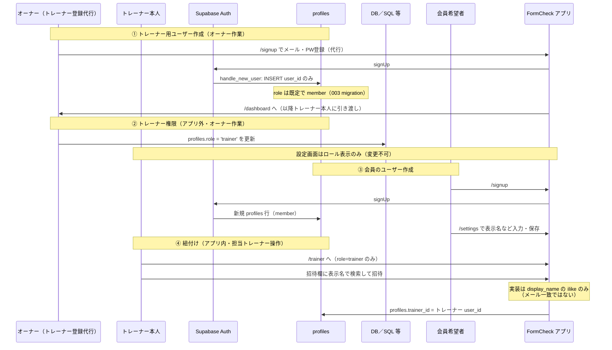

# フロー整理: トレーナー登録から会員登録・紐付けまで

**作成日**: 2026-04-25  
**最終方針追記**: 2026-04-25（オペレーション分担の確定）  
**前提**: [2026-04-25-01-pm-behavior-requirements.md](./2026-04-25-01-pm-behavior-requirements.md) のマンツーマン型ジム想定  
**関連実装**: `app/(auth)/signup/page.tsx`, `app/(auth)/login/page.tsx`, `app/(main)/settings/page.tsx`, `app/(main)/trainer/page.tsx`, `supabase/migrations/001_initial_tables.sql`, `003_extended_tables.sql`, `005_hardening.sql`

---

## 0. オペレーション方針（確定）

| 項目 | 担当 | 内容 |
|------|------|------|
| **トレーナー登録** | **店舗オーナー（私）** | メールアカウントの用意、`/signup` 相当の作成、**`profiles.role = 'trainer'` の付与**など、トレーナーが「アプリ上で自分でトレーナーになる」フローは**前提にしない**。実装は当面 DB／ダッシュボード運用でもよい。 |
| **会員の招待（担当紐付け）** | **担当トレーナー** | 会員が先にアプリ登録・表示名設定済みである前提で、**`/trainer` の「メンバーを招待」**から `trainer_id` を設定する。 |

この方針のもと、**§2 の「あるべき」図**と **§4 のステップ表**の「誰がやるか」を読み替える。§3 のシーケンスは **技術的なデータの流れ**としてそのまま有効。

---

## 1. 二層で読む

| 層 | 内容 |
|----|------|
| **A. あるべき体験（マンツー事業）** | 店舗オンボーディングとして自然な順序 |
| **B. 現状アプリの実際** | コードと DB が強制する順序・制約 |

以下、**A → B** の順で示す。B では **アプリ単体では完結しないステップ**を明示する。

---

## 2. A. あるべき体験フロー（マンツーPTジム＋確定方針）

店舗として望ましいのは「**誰がトレーナーか**が先に決まり、**会員は担当トレーナーの文脈で**アプリに乗る」こと。**トレーナー口座の開設はオーナー、会員の紐付けはトレーナー**とする。

```mermaid
flowchart LR
  subgraph 店舗・オペレーション
    T0[店舗がトレーナー採用・方針決定]
    T1[オーナーがトレーナー登録<br/>Auth + role=trainer まで完了]
    M0[会員が契約・初回面談]
    M1[会員がアプリ登録・表示名設定]
    M2[担当トレーナーが /trainer で招待]
  end
  T0 --> T1 --> M0 --> M1 --> M2
```

**理想のメッセージ**: 会員は「自分で全部設定する利用者」ではなく、**既に担当がいる前提**でホームに入る（依頼・次回予定などは別途プロダクト化）。

---

## 3. B. 現状アプリの実際のフロー

運用では **① をオーナーが代行**、**④ をトレーナーが実施**と読み替える（技術的には下記のとおり）。

### 3.1 全体像（シーケンス）



### 3.2 フローチャート（分岐つき）

```mermaid
flowchart TD
  S[オーナーまたは本人が<br/>/signup で新規登録]
  S --> P[Auth ユーザー作成]
  P --> H[handle_new_user: profiles 1行]
  H --> D[/dashboard へ遷移]
  D --> Q{このアカウントは<br/>トレーナー用?}

  Q -->|はい・運用方針| R{profiles.role<br/>=== trainer ?}
  R -->|いいえ| X[オーナー: DB等で role を trainer に更新]
  X --> R
  R -->|はい| TR[/trainer 表示]

  Q -->|いいえ・会員| SET[会員: 設定で表示名を付ける推奨]
  SET --> WAIT[担当トレーナーからの招待待ち]

  TR --> INV[担当トレーナー: 表示名で profiles 検索して招待]
  INV --> FOUND{一致ユーザーあり<br/>かつ trainer_id 空?}
  FOUND -->|はい| LINK[trainer_id を更新して紐付け完了]
  FOUND -->|いいえ| ERR[トースト: 見つからない／既に他トレーナー紐付け]

  WAIT --> INV
```

---

## 4. ステップ表（実装準拠＋確定方針の担当）

| 順 | アクター | 画面・操作 | システム上の結果 |
|----|----------|------------|------------------|
| 1 | **オーナー（店舗）** | トレーナー用に `/signup` → メール・パスワード（**本人の代行で作成**） | `auth.users` + `profiles`（`role` は DB 既定で **`member`**） |
| 2 | **オーナー（店舗）** | Supabase SQL Editor 等 | `profiles.role = 'trainer'` に更新（**アプリに該当 UI なし**） |
| 3 | **トレーナー本人** | 付与されたアカウントで `/login` → `/settings` | 表示名・身体情報を保存（`display_name` は**会員招待時の検索**に使われる） |
| 4 | **トレーナー本人** | `/trainer` | `role !== trainer` なら `/dashboard` にリダイレクト |
| 5 | 会員希望者 | `/signup` | 別ユーザーとして `profiles` 作成（`member`） |
| 6 | 会員 | `/settings` で表示名設定 | **担当トレーナーが招待で検索できる文字列**と一致させる必要あり（現実装） |
| 7 | **担当トレーナー** | `/trainer` の「招待」に文字列入力 → 招待 | `display_name` **部分一致 ilike** で 1 件目を採用し、`trainer_id` を自分の `user_id` に更新 |
| 8 | 会員 | 以降 `/videos` 等 | RLS により担当トレーナーから `?member=` 閲覧が可能 |

**解除**: **担当トレーナー**がメンバーカードから解除 → 該当 `profiles.trainer_id = null`（`trainer/page.tsx`）。

---

## 5. マンツー理想とのギャップ（要プロダクト判断）

| 観点 | 理想（§0 方針込み） | 現状 |
|------|----------------------|------|
| トレーナー登録 | **オーナーが登録・権限付与まで面倒を見る** | 技術的には `/signup` + DB `role` 更新。**方針と実装は整合**（アプリに専用ウィザードはない） |
| 会員登録 | 会員はアプリ登録後、**担当トレーナーが招待** | **会員は自力 signup**。紐付けは **`/trainer` の招待**のみ（方針どおりトレーナー担当） |
| 招待の特定子 | メール・電話で特定しやすいこと | **`display_name` の ilike のみ**（UI 文言は「メールまたは名前」だが実装は名前寄り）→ BL-P2-05 で改善余地 |
| 順序 | トレーナー口座が先、会員登録後にトレーナー招待 | **技術的には会員が先でも可**が、運用では **会員に表示名を決めてもらってからトレーナーが招待**が無難 |

---

## 6. 関連ドキュメント

| 文書 |
|------|
| [2026-04-25-01-pm-behavior-requirements.md](./2026-04-25-01-pm-behavior-requirements.md) |
| [2026-04-25-02-pm-residual-issues-backlog.md](./2026-04-25-02-pm-residual-issues-backlog.md)（招待メール化 BL-P2-05） |
| [2026-04-25-04-engineering-implementation-plan.md](./2026-04-25-04-engineering-implementation-plan.md)（Phase 1 の E0 招待 UX） |
| [../harsh-evaluation-2026-04-25-v5.md](../harsh-evaluation-2026-04-25-v5.md) §12 派生一覧 |

---

## 7. 改訂時のメモ欄

- **トレーナー自己登録をアプリで完結させる予定はない**（§0）。オーナー作業のまま運用し、必要なら将来「オーナー用管理画面」のみ検討。  
- 会員が「招待リンクだけで signUp + `trainer_id` 自動設定」になる場合は、**トークン付き URL** と RLS／トリガーの設計が必要（トレーナーが送るリンクのイメージ）。
